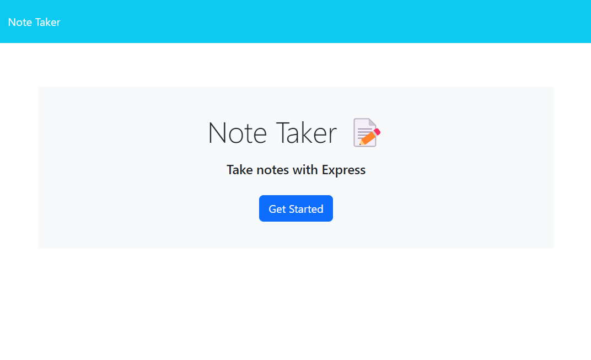
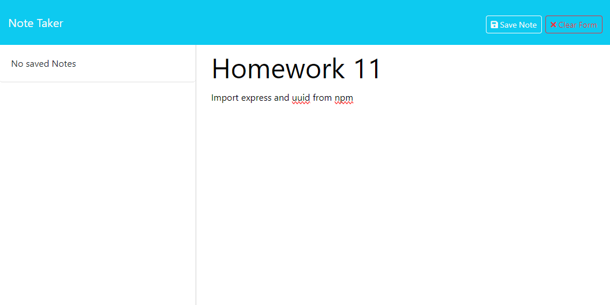
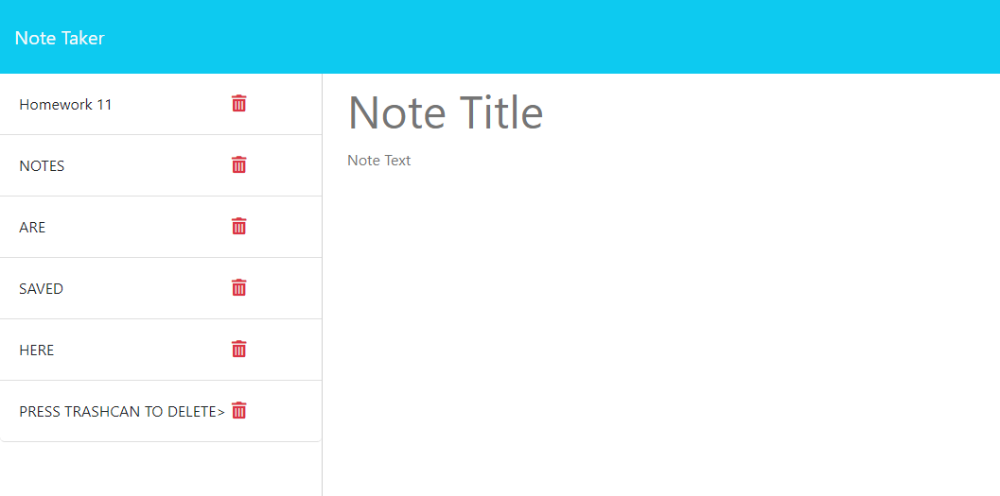

 # Note Taker

  
  

  ## Description
  This app is designed to take two inputs a title and a description of a Note and save it. The user can display existring notes or delete them.

  ## Table of Contents
  - [Usage](#usage)
  - [Credits](#credits)
  - [License](#license)
  - [How to Contribute](#how-to-contribute)
  - [Tests](#tests)
  - [Questions](#questions)

  ## Visuals
  
  
  

  ## Usage 
  From the home page you click the "Get Started" button and you will be redirected to the notes page. From here you can enter a note title and description and save it using the button that appears in the upper right corner. Once saved your task will be displayed on the left side of the screen. If you click on the saved task it will display it on the right. By clicking on the new task button that appears in the upper right corner you will be able to enter a new task. To Deleta a task you can click on the red trashcan icon next to the desired task and it will be deleted.

## Link to deployed app
https://note-taker-7lj0.onrender.com/

  ## Credits
  JD Tadlock: For all his instrudction in the Rutgers Coding Bootcamp

  ## License
  #### MIT
  A short and simple permissive license with conditions only requiring preservation of copyright and license notices. Licensed works, modifications, and larger works may be distributed under different terms and without source code.
  [Link to License](https://opensource.org/license/MIT)
  You can also check out the LICENSE in the repo.

  ## How to Contribute
  Check out the [Contributor Covenant](https://www.contributor-covenant.org/version/2/1/code_of_conduct/code_of_conduct.md)

  ## Tests
  No Tests

  ## Questions
  If you have any questions check out my [Github](https://github.com/TIrwin19).
